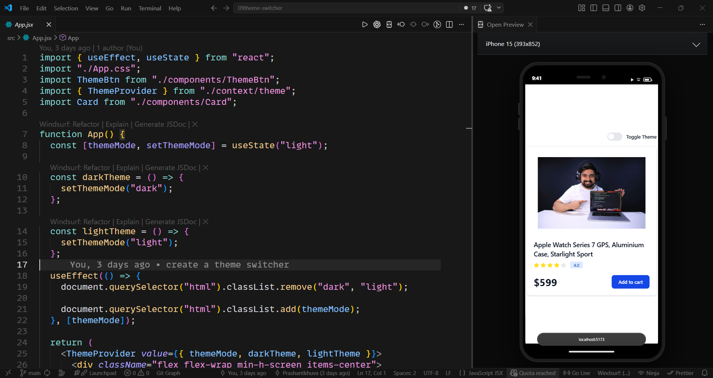
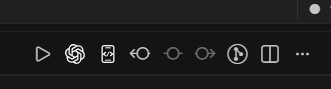

# Mobile Preview Simulator

  

Mobile Preview Simulator is a VS Code extension that opens your local web app inside a polished mobile device preview next to your code. It is built for quick frontend checks while you work, so you can keep editing in the main editor and see the result in a realistic phone or tablet frame beside it.

---

## Preview

### Mobile Preview in Action

  

---

## What The Extension Does

This extension helps you preview a local website or app in a mobile-sized webview directly inside VS Code.

It opens a side preview with:

* A realistic mobile device frame
* A device selector for phones and tablets
* A built-in URL bar for switching preview targets
* Support for common local dev URLs like `localhost:5173`
* A fast launch action from the editor title bar

The default preview target is `http://localhost:5173`, which works well for Vite and many local frontend projects.

---

## How It Works

When you open the preview, the extension creates a VS Code webview panel beside the editor. Inside that panel, it renders:

* A selectable device shell
* A live iframe preview of your local app
* Mobile-style chrome such as the status bar, camera area, and bottom address bar

You can switch between multiple device sizes to quickly check layout behavior without leaving VS Code.

---

## Supported Device Groups

The extension currently includes device presets from:

* Apple
* Samsung
* Google
* OnePlus
* Xiaomi

It also includes both phone and tablet layouts.

---

## Open The Preview

You can open the preview in two easy ways:

1. Run `Open Preview` from the Command Palette.

2. Click the preview shortcut button in the editor title bar:

  

After clicking the shortcut, the mobile preview opens in a side panel beside your current file.

---

## Typical Workflow

1. Start your local frontend app.
2. Open a project file in VS Code.
3. Click the `Open Preview` shortcut in the editor title bar, or run the command from the Command Palette.
4. The preview opens beside the editor.
5. Choose a device from the dropdown.
6. If needed, enter a different local URL in the in-preview address bar and press `Enter`.

---

## Best Use Cases

Mobile Preview Simulator is useful when you want to:

* Check responsive layouts while coding
* Review spacing, typography, and component sizing
* Quickly compare screens across different mobile devices
* Keep your preview inside VS Code instead of switching to a browser window

---

## Notes

* The preview is designed for local web apps and development servers.
* If your app is running on a different port, type the URL in the preview bar and press `Enter`.
* If you only type a port such as `3000`, the extension automatically turns it into `http://localhost:3000`.

---

## Extension Summary

In short, this extension gives you an in-editor mobile simulator for local web development. Open your app, click the preview shortcut, and you can inspect your UI in a mobile frame without leaving VS Code.
